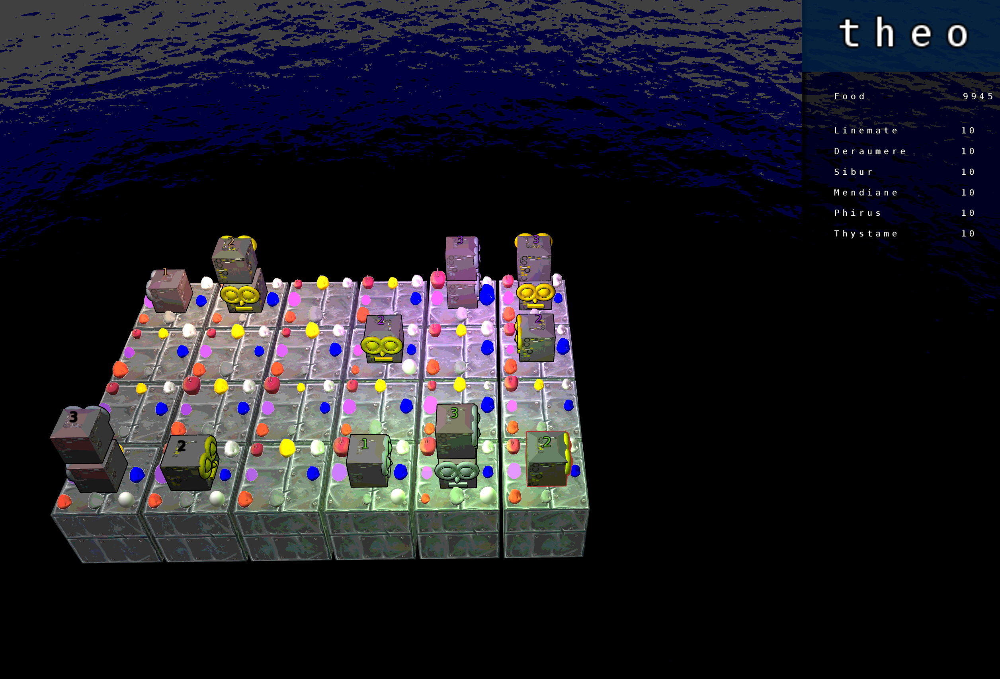
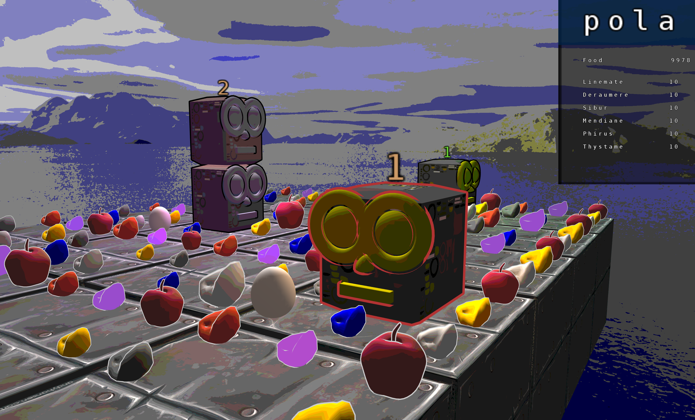
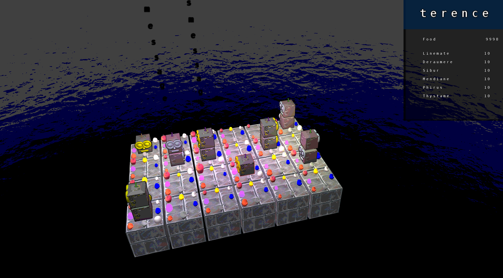
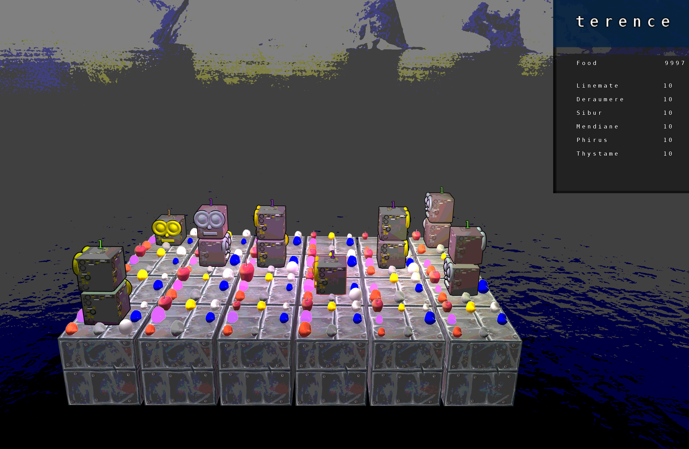

# Zappy 🎮🎲

A multi-players, single process and single thread game within a TCP/IP network 🤖
* **Techinal part**: Zappy is a team project consisting of 4 people creating a world with resources (**the server** written in C) with complex AIs (**the clients** written in Python) that have personalities and actions. Server-client and client-client interactions happen through the server on a TCP/IP network which is displayed on **a graphical interface** (written in C++). The game servers may only utilize **a SINGLE PROCCESS within a SINGLE THREAD**. Cool stuff about Zappy's technical part I'd like to mention about:
  * Along with my Starfleet Potatoes 🥔 ([@nkouris](https://github.com/nkouris) and [@tle-huu](https://github.com/tle-huu)) we came up with **SUPER GENERALIZED SERVER** (i.e. `void *` accepting **all** types of data, even those we don't know about yet; using of generalized libft function for queues, lists, etc.) therefore the server is easily adaptable to the other games.
  * We **MAXIMALLY REDUCED MALLOC CALLS** by initializing one global buffer capable enought to hold all required data within entire game, from the beginning till the end.
  * A time unit taken into consideration in **event driven engine** allows to choose game speed (`-t <timeunit>` while executing server binary). The greater time unit, the faster game goes, and everything happens in real time... it's... just... AMAZING! (`select()`, you're the best!).
  * Thanks to the use of `void *g_entity[]`'s array and player's assagnition based on its fd, we guarantee **O(1) access to all players' data** (We could use linked list instead, but it's slow and lame 🐑).
  * **Multiple graphical clients** are allowed, thus you can watch a game from as many computers/windows as you want, again in the real time! Cool, isn't it?
  </br>
* **Fun part**: Zappy is about creating families, surviving by eating food and collecting stones in order to level up. Each level has different requirements for a ritual, which makes the adventure more and more difficult for AI players, which play on their own, without any help form their creator. The game is over once 6 members of one family reach the highest possible level (8).
</br></br>





</br></br>

# How to run Zappy?
```
git clone https://github.com/psprawka/Zappy 42SV_Zappy
cd 42SV_Zappy
make
```
1. Open first window and run server under server's usage:
```
cd server
./server -p <port> -x <width> -y <height> -n <team> [<team>] [<team>] ... -c <nb> -t <t>
   -p port number,
   -x world width,
   -y world heigh,
   -n team\_name\_1 team\_name\_2 ...
   -c number of clients authorized at the beginning of the game,
   -t time unit divider (the greater t is, the faster game will go).
```
i.e. ```./server -p 8888 -x 10 -y 10 -n pola terence -c 5 -t 1```.
</br>

2. Open new window and:
* run a client manually on localhost or server's name with matching port via ```nc <server's name> <port>```, i.e. ```nc localhost 8888``` (remember to give your team name (```-n ...```) in order to be added to currect game) or
* run an AI client ```....... TERENCE HOW TO RUN IT 😂😂```.
</br>

3. Add gui client; in new window:
```
  cd gfx
  ./zappy <address> <port>
```
thus ```./zappy 0.0.0.0 8888``` on localhost with port matching our server.
</br>
To move a camera within gui, use ⬅️and ➡️ to move on x-axis, ```z``` and ```x``` to move on y-axis and ```w``` and ```s``` to move on z-axis.
</br>
Add more players repeating step 2 - the more players, the more fun 👯!
</br></br>

## Rules:
* each player starts with 10 food (1260 time units) and 0 stones,
* each player starts on level 1,
* the higher level, the more in sight,
* one food == 126 time units,
* eat to not starve, collect stones to level up,
* hatch an egg if you need a spot in your family,
* create family of (at least) 6 and win the game.
</br></br>

## Commands

Each player is allowed to use following commands:

| Command | Time | Description |
|:-:|:-:|:-:|
| advance | 7 | advance one square |
| left | 7 | turn 90 degrees left |
| right | 7 | turn 90 degrees right |
| see | 7 | see what's in your sight |
| inventory | 1 | look into your inventory |
| take <object> | 7 | take an object to your inventory |
| put <object> | 7 | drop an object from your inventory |
| kick | 7 | kick the players form your square |
| broadcast <text> | 7 | send a message to all players |
| incantation | 300 | begin the ritual of incantation |
| fork | 42 | lay an agg and create additional spot in a family |
| connect_nbr | 0 | number of unused connection within a family |
 
 </br>
  
## Incantaion
In order to win you and your family member have to achieve level 8 (at least 6 family members) by collection stones and having an incantation ritual. These stones have 6 distinct kinds: linemate, deramere, sibur, mendiane, phiras and thystame.
Each level has different ritual requirements:

| Level | Number of players | Linemate | Deraumere | Sibur | Mendiane | Phiras | Thystame |
|:-:|:-:|:-:|:-:|:-:|:-:|:-:|:-:|
| 1-2 | 1 | 1 | 0 | 0 | 0 | 0 | 0 |
| 2-3 | 2 | 1 | 1 | 1 | 0 | 0 | 0 |
| 3-4 | 2 | 2 | 0 | 1 | 0 | 2 | 0 |
| 4-5 | 4 | 1 | 1 | 2 | 0 | 1 | 0 |
| 5-6 | 4 | 1 | 2 | 1 | 3 | 0 | 0 |
| 6-7 | 6 | 1 | 2 | 3 | 0 | 1 | 0 |
| 7-8 | 6 | 2 | 2 | 2 | 2 | 2 | 1 |

</br>

## Made by
| | |
|:-:|:-:|
| 🇫🇷[Terence Le Huu Phuong](https://github.com/tle-huu) | server/ai |
| 🇵🇱[Paulina Sprawka](https://github.com/psprawka) | server |
| 🇯🇴[Zeid Tisnes](https://github.com/zedin27) | gui |
| 🇬🇧[Theodore Walton](https://github.com/theo-walton)| gui |
| | |
</br>
