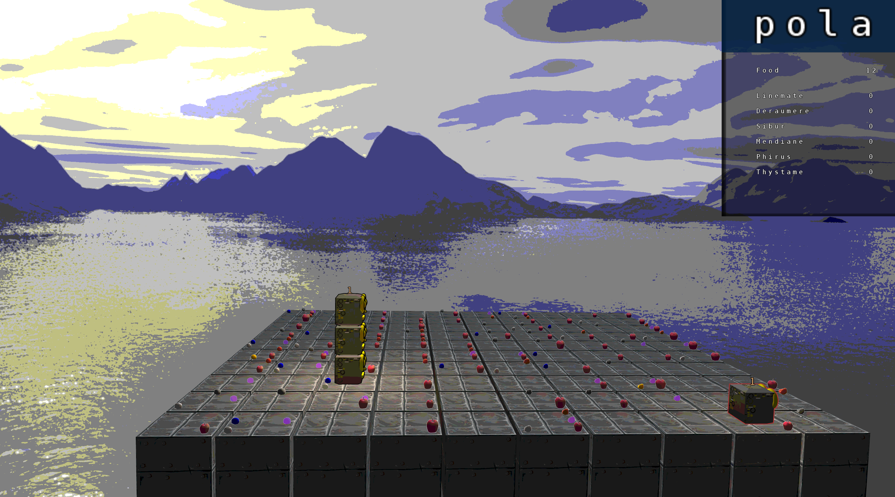
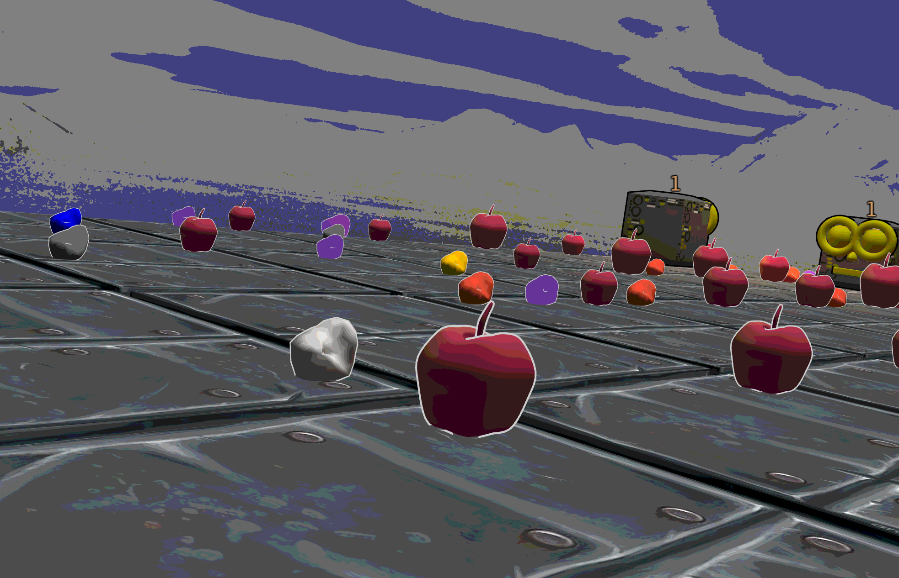

# Zappy

## What is Zappy?
Zappy is the culmination of your previous efforts in advanced UNIX: here you will realize a multi-player game in TCP/IP network. This game will consist of a server managing the playground, a GUI client that displays the state of the game board, and AI clients who connect to the server to control a player in the field.

## How to start it?
First, you need to run `make deps` to install all the dependencies needed. It might take a while because of `gl` packages needed. After `make deps`, do a `make all` to compile. Once everything is compiled, simply run `./zappy` and magic will happen :)

## Screenshots

## Made by
* 🇫🇷[Terrance Huu-Luu](https://github.com/tle-huu)
* 🇵🇱[Paulina Sprawka](https://github.com/spraweczga)
* 🇯🇴[Zeid Tisnes](https://github.com/zedin27)
* 🇬🇧[Theodore Walton](https://github.com/theo-walton)
